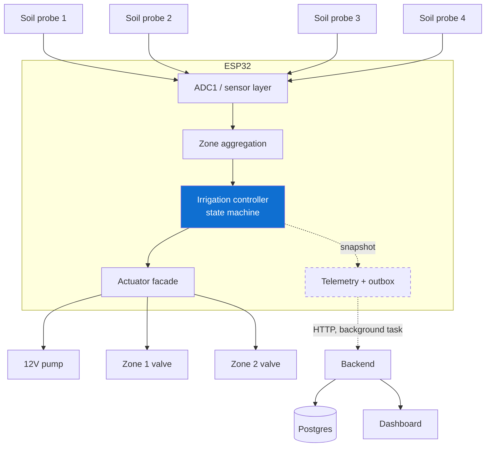
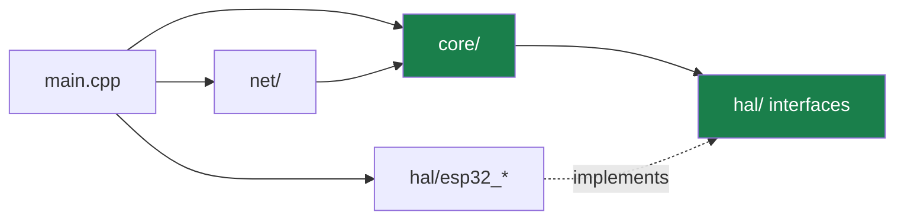

# HYDRAX — Architecture (Phase 1)

## The governing principle

> A real ESP32 can measure soil moisture, make a local irrigation decision,
> control the correct zone, and report the real system state to the dashboard —
> **even when the Internet is unavailable.**

Every structural decision below follows from that sentence. The cloud is an
observer, never a participant.

---

## System overview

Solid lines are the control path. **Dashed lines are the monitoring path and
can fail without affecting irrigation.**

---

## Layers

### Firmware

| Layer | Directory | Responsibility | Knows about Arduino? |
| --- | --- | --- | --- |
| Configuration | `src/config/` | Pins, calibration, thresholds, timings | No |
| Core | `src/core/` | Sensor model, zone aggregation, state machine, telemetry model, Wi-Fi policy, outbox | **No** |
| HAL | `src/hal/` | Interfaces + ESP32 and simulated implementations | Only the `esp32_*` files |
| Net | `src/net/` | HTTP uplink on a background task | Yes |
| Entry | `src/main.cpp` | Composition root — the only file that names concrete hardware | Yes |

The critical rule: **`src/core/` contains no `#include <Arduino.h>`.** That is
what makes the irrigation logic compilable and testable on a laptop, and it is
why the test suite can verify a ten-minute timeout in microseconds.

Dependencies point inward. Core depends on interfaces, never on
implementations.

### Backend

| Module | Responsibility |
| --- | --- |
| `src/config.ts` | The only reader of `process.env` |
| `src/domain/validate.ts` | Trust boundary — rejects anything malformed or physically impossible |
| `src/domain/alerts.ts` | Alert rules: raise, de-duplicate, auto-resolve |
| `src/db/repository.ts` | All SQL |
| `src/routes/` | HTTP endpoints |
| `src/app.ts` | Router assembly + error handling |

---

## Data flow

### Control loop (every 1 s, on the ESP32)

1. Every 2 s, read all four probes. The HAL takes 5 samples per probe and
   returns the **median**, rejecting spikes from long unshielded leads.
2. Each raw count is range-checked, converted to a **relative moisture
   percentage** using that probe's dry/wet calibration, and smoothed with an
   exponential moving average.
3. Each zone is reduced to the **mean of its valid probes only**. A dead probe
   reading zero is excluded rather than averaged in, because averaging it in
   would drag the zone down and trigger irrigation the soil does not need.
4. The state machine evaluates the zones and acts. See
   [STATE_MACHINE.md](STATE_MACHINE.md).

### Telemetry path (every 15 s)

1. The control loop captures a `TelemetrySnapshot` — a pure read of current
   state — and pushes it into an in-memory outbox. This takes microseconds.
2. A **separate FreeRTOS task, pinned to core 0**, drains the outbox over HTTP.
   The control loop runs on core 1 and never waits for the radio.
3. If the outbox fills while offline, the **oldest** entry is dropped. For
   monitoring, the freshest state matters more than a complete history, and an
   unbounded buffer inside a control system is not acceptable.

---

## Key design decisions

### Why the pump never starts before a valve opens

`IrrigationHardware` refuses `startPump()` when every valve is closed. Running a
pump against a closed system (deadheading) destroys it. The state machine
already sequences valve → settle → pump, but the façade enforces the invariant
independently, so a future logic bug still cannot produce the damaging
combination. The reverse holds on shutdown: pump off, spin-down delay, then the
valve closes.

### Why one zone at a time

There is one pump. Two open valves split its pressure and under-irrigate both
zones. `openZone()` refuses while another zone is open, and the state machine
serves the **driest eligible zone first**.

### Why starting and continuing have different sensor requirements

- **To start**: both probes in the zone must be valid. Starting is the
  conservative direction — do not commit water on half the evidence.
- **To continue**: one valid probe is enough, so a single glitching probe does
  not abort a legitimate run.
- **Zero valid probes while running**: stop immediately. Irrigating blind is
  the one thing that must never continue.

### Why a zone losing its probes does not halt the whole controller

If zone 1's probes both die, zone 2 still has healthy data and should still be
served. The global `SENSOR_ERROR` state is reserved for losing *every* probe on
the farm. The affected zone cannot restart anyway, because starting demands
full coverage.

### Why `ACTUATOR_ERROR` latches but `SENSOR_ERROR` does not

A sensor fault is often transient — a loose connector, moisture on a header —
and recovers on its own, so the controller resumes automatically once valid
data returns. An actuator fault means a pump or valve did not do what it was
told. That is a physical problem someone has to look at, so the controller
latches, holds everything off, and requires an explicit fault clear.

### Why the backend stores config the firmware ignores

Zone thresholds can be set through the API, but Phase 1 firmware runs on
compiled-in values. Making the device fetch its thresholds would put the
backend in the path of a safety-relevant decision. The API responses say
`"applied_by_device": false` rather than implying otherwise. Pushing config to
the device — with local caching and validation so it still cannot become a
dependency — is Phase 2 work.

### Why the timestamps work the way they do

The ESP32 has no guaranteed real-time clock and must work with no Internet, so
it cannot be the source of wall-clock truth. The device reports `uptime_ms`
(monotonic since boot) plus `device_time` **only when NTP has actually synced**.
The **server** stamps `received_at` on arrival, and that is the timeline the
history and dashboard use.

---

## Failure behaviour

| Failure | Irrigation | Monitoring |
| --- | --- | --- |
| Wi-Fi drops | Unaffected | Telemetry buffered, flushed on reconnect |
| Backend down | Unaffected | Buffered; oldest dropped when full |
| Backend rejects a payload (4xx) | Unaffected | Payload discarded so it cannot block the queue head |
| One probe fails | Zone continues degraded; cannot start a new run | `DEGRADED`, alert raised |
| All probes in a zone fail | That zone stops and cannot start | Alert raised |
| Every probe fails | All irrigation stops, `SENSOR_ERROR` | Alert raised |
| Valve or pump does not respond | Everything off, `ACTUATOR_ERROR` latched | Critical alert |
| Runtime exceeds maximum | Pump cut, zone locked out 30 min | Critical alert |
| ESP32 resets mid-run | Outputs driven off before anything else runs | Device briefly offline |

---

## What Phase 1 deliberately excludes

Predictive maintenance and RUL models, pump failure prediction, advanced leak
localization or a leak-detection robot, multi-farm SaaS, payments and
subscriptions, and AI-driven dashboards.

The foundation those need is a controller whose reported state is trustworthy.
That is what this phase builds.

The mobile app was originally on this list and has since been built —
read-only, on the same `/api/v1` contract the dashboard uses, and outside the
control path for the same reasons the dashboard is. It adds no capability the
backend did not already expose. See [MOBILE.md](MOBILE.md).
