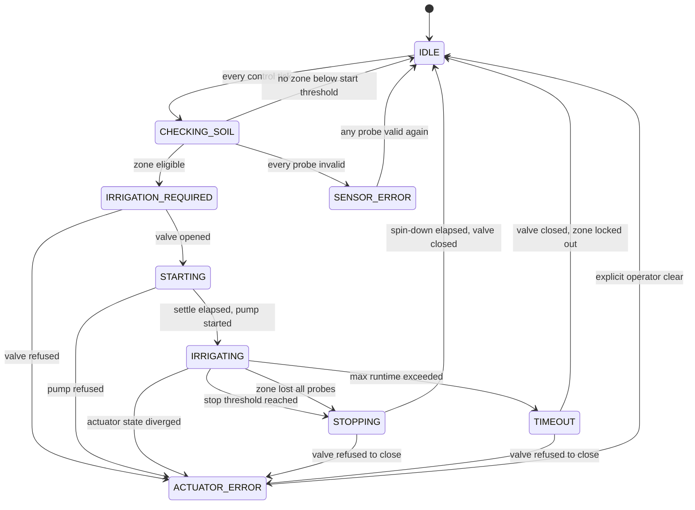

# HYDRAX — Irrigation State Machine

Implemented in `firmware/src/core/irrigation_controller.cpp`. This is the
**single source of truth** for whether water flows. No other module commands the
pump or a valve during normal operation.

---

## States



| State | Meaning | Outputs |
| --- | --- | --- |
| `IDLE` | Nothing to do | pump off, valves closed |
| `CHECKING_SOIL` | Evaluating zones this tick | unchanged |
| `IRRIGATION_REQUIRED` | Zone selected, opening its valve | valve opening |
| `STARTING` | Waiting for the valve to travel | valve open, pump **off** |
| `IRRIGATING` | Watering | valve open, pump on |
| `STOPPING` | Pump cut, waiting for spin-down | pump off, valve still open |
| `SENSOR_ERROR` | No usable data anywhere | everything off |
| `ACTUATOR_ERROR` | A driver did not respond — **latched** | everything off |
| `TIMEOUT` | Runtime ceiling hit — a fault, not a normal stop | pump off, valve closing |

---

## Why the sequencing matters

```
START:  open valve ──(2 s settle)──> start pump
STOP:   stop pump  ──(2 s spin-down)──> close valve
```

The pump is never energized against a closed system, and the valve never shuts
on a spinning pump. `IrrigationHardware` enforces both invariants independently
of this state machine, so a logic error upstream still cannot damage the pump.

---

## Start conditions

A zone is eligible to start only when **all** of these hold:

| Condition | Rationale |
| --- | --- |
| Zone thresholds are valid | A bad hysteresis band is rejected at boot; the zone is disabled, not silently accepted |
| **Both** probes valid | Starting is the conservative direction — do not water on half the evidence |
| Zone average `<` start threshold | The actual demand signal |
| Not within `kZoneCooldownMs` of its last stop | Anti-cycling backstop, independent of the band |
| Not within `kTimeoutLockoutMs` of a timeout | A zone that overran needs looking at |

When both zones qualify, the **driest** wins; ties break toward the lower zone
id.

## Stop conditions

| Trigger | Result |
| --- | --- |
| Average `>=` stop threshold **and** run `>=` minimum runtime | Normal stop → `STOPPING` → `IDLE` |
| Zone loses **all** valid probes | Stop → `IDLE`, `SENSOR_ERROR` event + alert |
| Run reaches maximum runtime | `TIMEOUT`, pump cut, zone locked out 30 min |
| Pump or valve state diverges from commanded | `ACTUATOR_ERROR`, latched |

---

## Hysteresis

Irrigation is **not** `if (moisture < threshold) pump on`. That formulation
chatters the pump every time a reading wobbles across a single setpoint.

Instead each zone has a band:

```
100% ┤
     │                          ╭──────── stop at 55%  → pump OFF
     │                         ╱
     │   ~~~~~~~~~~~~~~~~~~~~~╱     (irrigating: keep going through
     │                       ╱       the whole band, not just past start)
 35% ┤━━━━━━━━━━━━━━━━━━━━━━╱────── start at 35%  → pump ON
     │  ╲__________________╱
   0% ┤
     └─────────────────────────────────────────────► time
           drying              watering
```

Crossing back above 35% does **not** stop the run; it continues to 55%. Three
further guards back this up:

- **Minimum runtime (30 s)** — a noisy reading right after start cannot produce
  a two-second burst.
- **Zone cooldown (5 min)** — enforced rest between runs of the same zone, even
  if the band were misconfigured.
- **Configuration validation at boot** — a band narrower than 5 points, or
  inverted, disables the zone and logs an error rather than being accepted.

---

## Timing constants

Defined once in `firmware/src/config/hydrax_config.h`.

| Constant | Default | Purpose |
| --- | --- | --- |
| `kControlIntervalMs` | 1 s | State machine cadence |
| `kSensorIntervalMs` | 2 s | Sensor acquisition cadence |
| `kValveSettleMs` | 2 s | Valve open → pump start |
| `kPumpSpindownMs` | 2 s | Pump stop → valve close |
| `kMinIrrigationMs` | 30 s | Shortest permitted run |
| `kMaxIrrigationMs` | 10 min | Hard ceiling; exceeding it is a fault |
| `kZoneCooldownMs` | 5 min | Rest between runs of a zone |
| `kTimeoutLockoutMs` | 30 min | Lockout after a timeout |

---

## Fault recovery

| Fault | Recovery |
| --- | --- |
| `SENSOR_ERROR` | **Automatic** once any probe returns valid data. A probe must also deliver 3 consecutive good readings before it is trusted again, so a flapping connector does not bounce the controller. |
| `TIMEOUT` | **Automatic** after the 30-minute lockout, for that zone only. Other zones keep operating throughout. |
| `ACTUATOR_ERROR` | **Manual only** — `clearActuatorFault()`, which itself refuses unless the hardware confirms a safe state. A pump or valve that did not respond is a physical problem. |

---

## Transition loop safety

`tick()` processes at most 5 transitions per call, so the machine can move
`IDLE → CHECKING_SOIL → IRRIGATION_REQUIRED → STARTING` within one tick while a
future cycle in the transition graph still cannot spin the control loop. A
`evaluatedThisTick_` flag prevents `IDLE` and `CHECKING_SOIL` ping-ponging.

All time comparisons use wrap-safe unsigned subtraction, so behaviour is correct
across the ~49.7-day `millis()` rollover.
