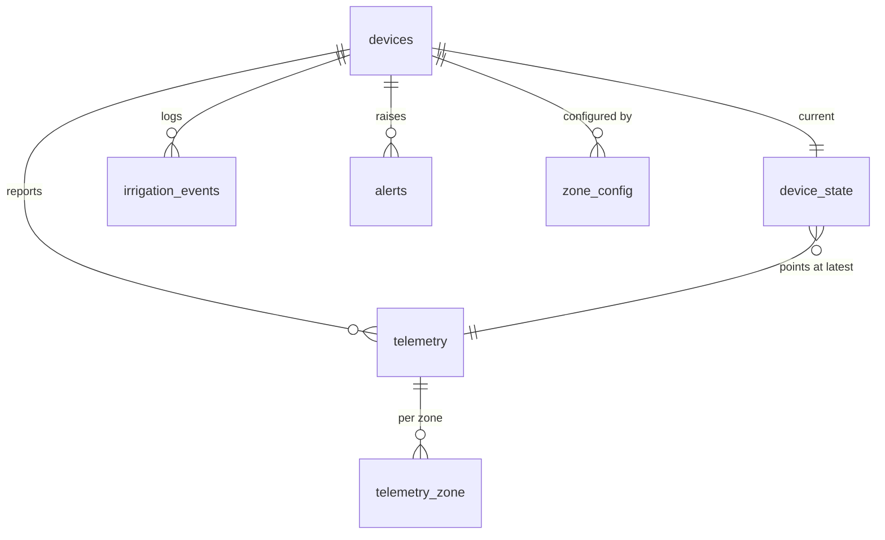

# HYDRAX — Telemetry & API

## How time is handled

The ESP32 has no guaranteed real-time clock and must keep working with no
Internet, so it is **not** the source of wall-clock truth.

| Field | Source | Meaning |
| --- | --- | --- |
| `uptime_ms` | Device | Milliseconds since boot. Monotonic, always present. |
| `device_time` | Device | ISO-8601 UTC, **only when NTP has actually synced**. `null` otherwise — never a guess. |
| `received_at` | Server | Assigned on arrival. **This is the timeline** used by history, alerts and the dashboard. |

A device that has been offline flushes buffered samples on reconnect, so several
samples may share a near-identical `received_at` while their `uptime_ms` values
remain correctly ordered. Use `uptime_ms` to order events within a boot session.

---

## Telemetry payload

`POST /api/v1/telemetry`

```json
{
  "device_id": "HYDRAX-001",
  "firmware": "0.1.0-phase1",
  "uptime_ms": 842300,
  "device_time": null,
  "simulated": false,
  "soil": {
    "zone_1": { "sensor_1": 42.0, "sensor_2": 45.0, "average": 43.5, "valid_sensors": 2 },
    "zone_2": { "sensor_1": 61.0, "sensor_2": 58.0, "average": 59.5, "valid_sensors": 2 }
  },
  "actuators": {
    "pump": false,
    "zone_1_valve": false,
    "zone_2_valve": false
  },
  "irrigation": {
    "state": "IDLE",
    "run_ms": 0,
    "active_zone": null
  },
  "controller": { "status": "OK" },
  "network": { "wifi_connected": true, "rssi": -58 },
  "sensors": [
    { "id": 1, "zone": 1, "raw": 2261, "percent": 42.0, "valid": true, "status": "OK" },
    { "id": 2, "zone": 1, "raw": 2210, "percent": 45.0, "valid": true, "status": "OK" },
    { "id": 3, "zone": 2, "raw": 1963, "percent": 61.0, "valid": true, "status": "OK" },
    { "id": 4, "zone": 2, "raw": 2014, "percent": 58.0, "valid": true, "status": "OK" }
  ]
}
```

### Field notes

- **All percentages are *relative soil moisture*** — linearly interpolated
  between that probe's dry-air and submerged references. This is **not**
  volumetric water content. See [HARDWARE.md](HARDWARE.md#calibration).
- `average` is the mean of the zone's **valid** probes only. An invalid probe is
  excluded, not averaged in as zero.
- `valid_sensors` is `0`, `1` or `2`. At `1` the zone is *degraded*: it keeps an
  existing run going but cannot start a new one.
- `active_zone` is **1-based**, or `null` when idle. (Internally the firmware
  uses 0-based zone ids; the conversion happens at the telemetry boundary.)
- `simulated` is `true` when readings came from a simulated source. The
  dashboard labels such devices explicitly so synthetic values are never
  mistaken for field data.
- `sensor.id` is global and 1-based: zone 1 owns sensors 1–2, zone 2 owns 3–4.

### Enumerations

| Field | Values |
| --- | --- |
| `irrigation.state` | `IDLE`, `CHECKING_SOIL`, `IRRIGATION_REQUIRED`, `STARTING`, `IRRIGATING`, `STOPPING`, `SENSOR_ERROR`, `ACTUATOR_ERROR`, `TIMEOUT` |
| `controller.status` | `OK`, `DEGRADED`, `SENSOR_ERROR`, `ACTUATOR_ERROR` |
| `sensor.status` | `OK`, `DRIVER_ERROR`, `OUT_OF_RANGE`, `BAD_CALIBRATION`, `FAULTED` |

---

## Event payload

`POST /api/v1/events`

```json
{
  "device_id": "HYDRAX-001",
  "uptime_ms": 842300,
  "type": "IRRIGATION_STARTED",
  "zone": 1,
  "moisture": 32.5,
  "duration_ms": 0,
  "detail": "hysteresis start"
}
```

`zone` is `-1` (or omitted) for events that are not zone-specific; the backend
normalizes that to `null`.

| `type` | Raised when |
| --- | --- |
| `CONTROLLER_STARTED` | Controller booted |
| `ZONE_ACTIVATED` | A zone was selected and its valve opened |
| `IRRIGATION_STARTED` | Pump started |
| `IRRIGATION_STOPPED` | Run finished; `duration_ms` carries the run length |
| `IRRIGATION_TIMEOUT` | Maximum runtime exceeded — pump cut |
| `SENSOR_ERROR` | Usable sensor data lost |
| `SENSOR_RECOVERED` | Sensor data restored |
| `ACTUATOR_ERROR` | A pump or valve did not respond |
| `FAULT_CLEARED` | Operator cleared a latched actuator fault |
| `SAFE_SHUTDOWN` | External emergency stop |

---

## Validation

Ingestion is a trust boundary. Payloads are rejected with **400** and a list of
every problem found (not just the first). Beyond type and range checks, the
backend rejects physically impossible states:

- `pump: true` with every valve closed — that combination describes a
  deadheading pump, and recording it as fact would put a lie in the history.
- More than one zone valve open — there is one pump.
- `active_zone` naming a zone absent from `soil`.

**A 400 is permanent.** The firmware discards a payload the backend rejects
rather than retrying it forever, because a rejected payload at the head of the
outbox would block every later payload behind it. Transport failures, 5xx, 408
and 429 are retried.

---

## Authentication

Both ingestion endpoints require `X-Device-Key`, compared in constant time
against `HYDRAX_DEVICE_KEY`.

Operator endpoints — `PUT /api/v1/devices/:id/config` and
`POST /api/v1/alerts/:id/resolve` — require a **separate** `X-Admin-Key`
matching `HYDRAX_ADMIN_KEY`. The device key is not accepted for them.

The server refuses to start unless both are set and differ, or
`HYDRAX_ALLOW_INSECURE=true` is given explicitly.

Read endpoints are unauthenticated in Phase 1, on the assumption of a trusted
LAN. See [known limitations](TESTING.md#known-gaps).

---

## Endpoints

| Method | Path | Purpose |
| --- | --- | --- |
| `GET` | `/health/live` | Liveness — process is up. Never touches the database. |
| `GET` | `/health` | Readiness — process is up *and* the database is reachable. `503` (not a crash) if not. |
| `POST` | `/api/v1/telemetry` | Ingest a sample *(auth)* |
| `POST` | `/api/v1/events` | Ingest an event *(auth)* |
| `GET` | `/api/v1/devices` | List devices with online status |
| `GET` | `/api/v1/devices/:id` | Device detail + current state |
| `GET` | `/api/v1/devices/:id/telemetry?limit=` | Telemetry history |
| `GET` | `/api/v1/devices/:id/events?limit=` | Event history |
| `GET` | `/api/v1/devices/:id/config` | Zone thresholds |
| `PUT` | `/api/v1/devices/:id/config` | Set zone thresholds *(operator auth)* |
| `GET` | `/api/v1/alerts?active=` | Alerts (active by default) |
| `POST` | `/api/v1/alerts/:id/resolve` | Manually resolve an alert *(operator auth)* |
| `GET` | `/api/v1/dashboard?events=` | Everything the dashboard renders, in one call |
| `POST` | `/api/v1/requests` | Submit a customer quote request *(public)* |
| `GET` | `/api/v1/requests` | List quote requests *(operator auth)* |
| `GET` | `/api/v1/requests/:reference` | One quote request *(operator auth)* |
| `PATCH` | `/api/v1/requests/:reference/status` | Update request status *(operator auth)* |

Responses cap `limit` at 500. Request bodies are capped at 64 KB and refused
with **413** while streaming, not after buffering.

---

## Storage model



History (`telemetry` + `telemetry_zone`) is append-only. `device_state` holds
one row per device pointing at its newest sample, so the dashboard never scans
history to answer "what is happening now".

Retention prunes telemetry older than `HYDRAX_RETENTION_DAYS` (default 30) but
never the row a device's current state points at — a device that has gone quiet
keeps its last known state instead of vanishing from the dashboard.

A partial unique index enforces **at most one active alert per (device, type)**,
so a probe flapping once a second produces one open alert rather than thousands.
